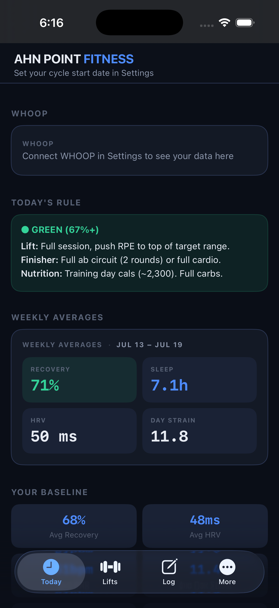
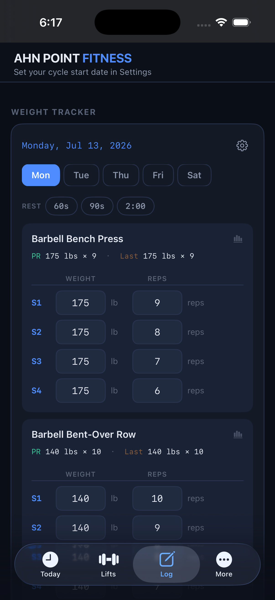
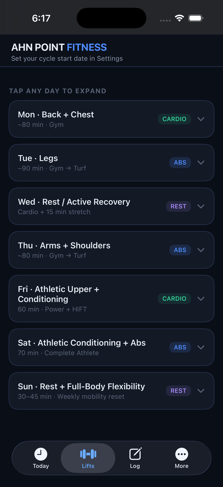

# AHN POINT FITNESS

A native iOS training companion for an 8-week recomposition protocol — structured lifting, workout logging with PR tracking, and live recovery data from the WHOOP API. Pure SwiftUI + SwiftData, zero third-party dependencies.

<p align="center">
  
  
  
</p>

## Features

- **Workout logging** — set-by-set weight/reps entry per programmed exercise, with per-exercise `PR / Last` lines, progress charts (Swift Charts), and editable history.
- **WHOOP integration** — OAuth2 (PKCE-style state validation, Keychain token storage, automatic refresh) against the WHOOP v2 API: recovery, HRV, sleep, and strain, with 30-day baselines and Monday-anchored weekly averages.
- **Recovery-aware training** — the day's recovery score picks a Green/Yellow/Red rule set on the Today tab and a matching banner on the Log tab.
- **Training cycles** — an editable cycle start date drives the header ("Week 3 of 8"), deload/taper flags, and the Plan tab's current-week highlight. No hardcoded dates.
- **Rest timer** — 60s/90s/2:00 chips start a countdown pill; a local notification fires when rest is up, even with the phone locked.
- **Trends** — weekly tonnage chart plus a current-week volume vs. WHOOP strain/recovery comparison.
- **Data portability** — versioned JSON export/import with idempotent merge (re-importing the same file is a no-op).
- **Demo mode** — one tap in Settings seeds 4 weeks of plausible logs and a sample WHOOP card, and removes exactly what it added. Try the app without a WHOOP account.

## Architecture

```
AhnPointFitness/
├── AhnPointFitnessApp.swift    @main — SwiftData ModelContainer, WHOOP auth env object
├── Models/                     @Model WorkoutLog / SetEntry (cascade delete)
├── Design/                     Color + typography tokens (dark mode only)
├── Components/                 Reusable cards, chips, rules, zone cards
├── Services/
│   ├── WhoopAuth.swift         OAuth2 via ASWebAuthenticationSession + Keychain
│   ├── WhoopService.swift      v2 API client — auto-refresh on 401, backoff on 5xx
│   ├── WhoopTodayState.swift   Shared observable snapshot w/ 30-min staleness guard
│   └── RestTimerState.swift    Countdown + UNUserNotificationCenter
├── Resources/                  Program content + pure logic (CycleModel, TrendsModel,
│                               ExerciseStats, DataExportService, DemoSeeder)
└── Views/                      Today / Lifts / Log / More / Settings
AhnPointFitnessTests/           26 unit tests over the pure logic layer
```

Design notes:

- **Pure logic, thin views.** Stats, cycle math, tonnage aggregation, and export merge live in value types with injectable clocks — all unit-tested with an in-memory `ModelContainer`.
- **SwiftData reactivity as the contract.** Views own `@Query`; derived stats are computed inline per render so every save propagates without manual invalidation.
- **Eastern-Time everywhere.** All calendar math (log keys, weekly windows, cycle weeks) is pinned to `America/New_York` with Monday weeks, so displays and aggregates always agree.
- **Folder-synchronized Xcode project** with a generated Info.plist — new files join the target by existing on disk.

## Getting started

Requires Xcode 15+ (project uses folder-synchronized groups), iOS 17+.

```bash
git clone https://github.com/colemanahn21-svg/ahn-point-fitness.git
cd ahn-point-fitness
open AhnPointFitness.xcodeproj
```

1. Pick your signing team (a free personal team works) and run on a simulator or device.
2. **No WHOOP account?** Settings (gear icon on the Log tab) → *Load Demo Data*.
3. **Have WHOOP API credentials?** Copy the template and fill it in — the real file is gitignored:

   ```bash
   cp WhoopSecrets.swift.example AhnPointFitness/Services/WhoopSecrets.swift
   ```

   Then Settings → *Connect WHOOP*.

### Build & test from the CLI

```bash
xcodebuild -project AhnPointFitness.xcodeproj -scheme AhnPointFitness \
  -destination 'platform=iOS Simulator,name=iPhone 17' build

xcodebuild test -project AhnPointFitness.xcodeproj -scheme AhnPointFitness \
  -destination 'platform=iOS Simulator,name=iPhone 17'
```

## Docs

- [`docs/recomp_mobile.html`](docs/recomp_mobile.html) — the original HTML design mock the UI was built against
- [`docs/flows.html`](docs/flows.html) / [`docs/flows.json`](docs/flows.json) — user-flow diagrams

## Tech

Swift 5.9 · SwiftUI · SwiftData · Swift Charts · ASWebAuthenticationSession · Keychain Services · UserNotifications · XCTest — no external dependencies.
